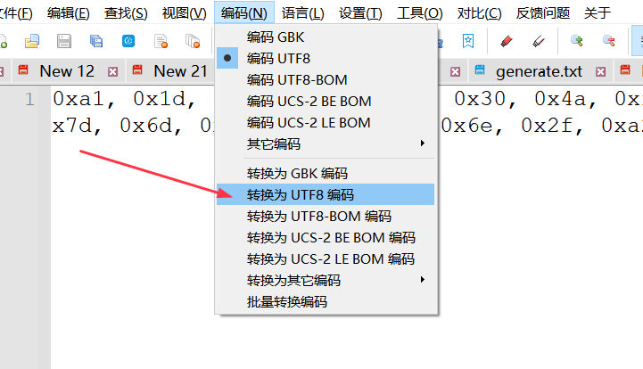
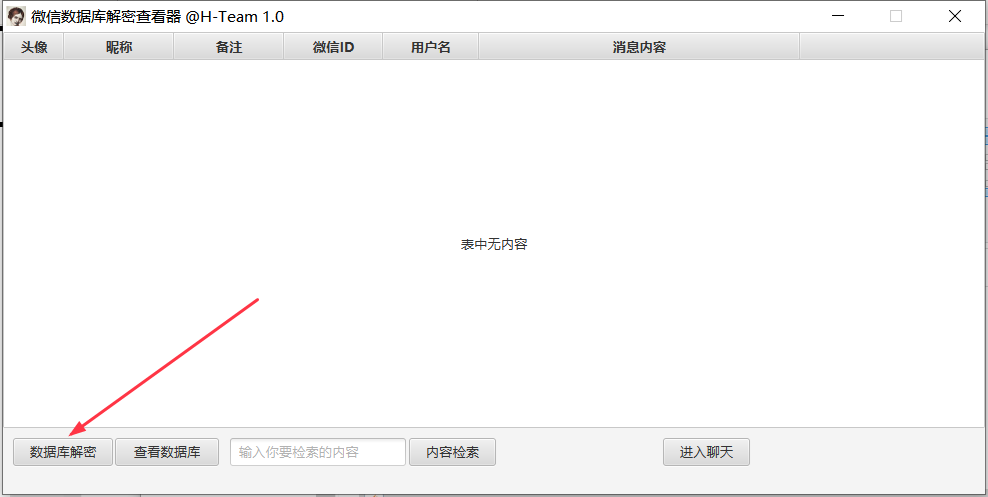
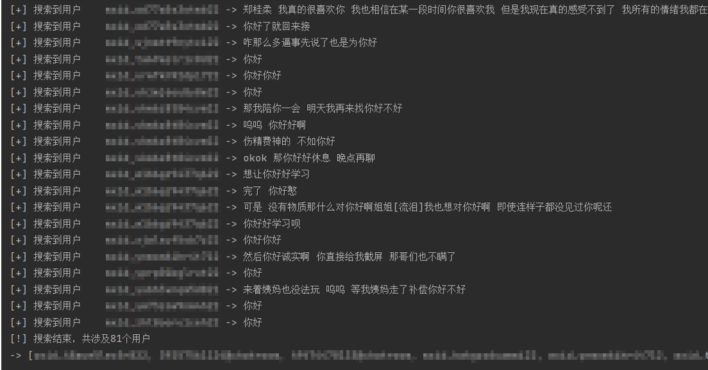
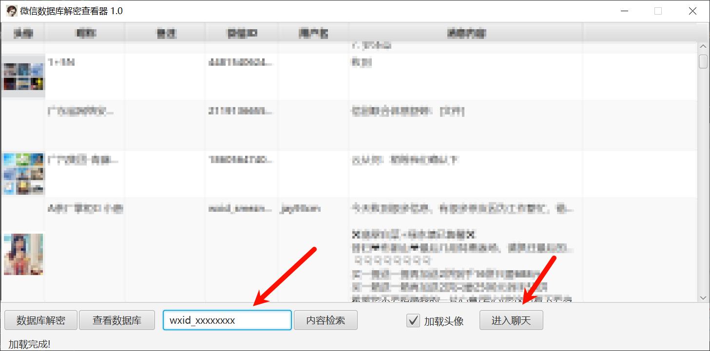
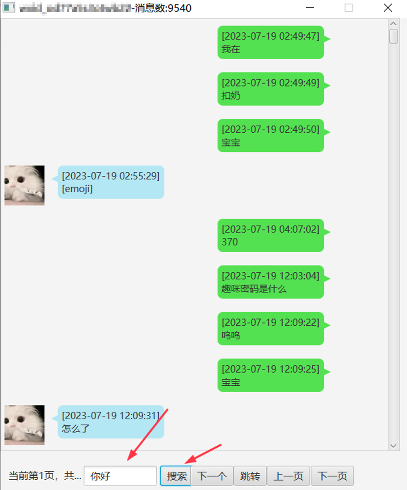
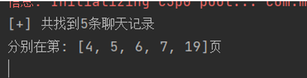
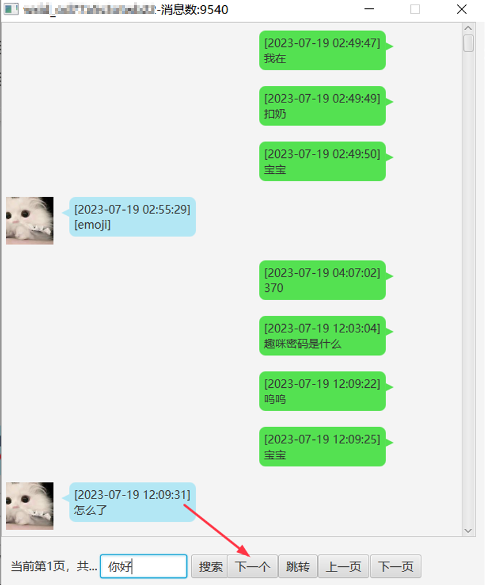
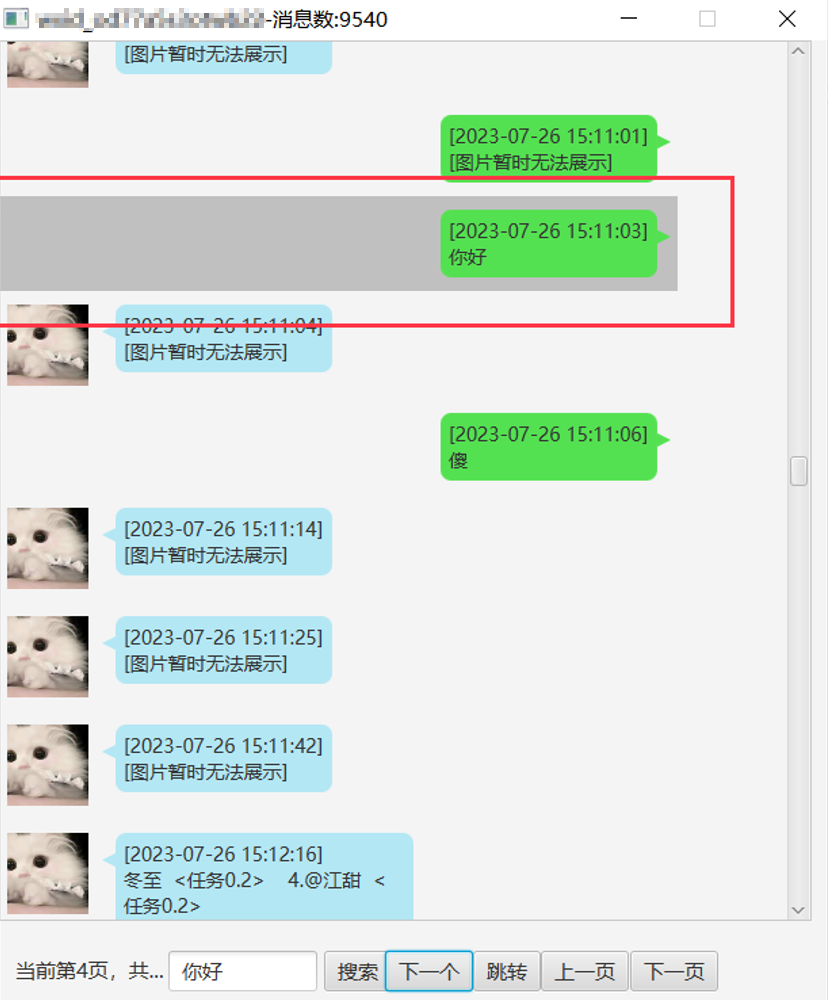
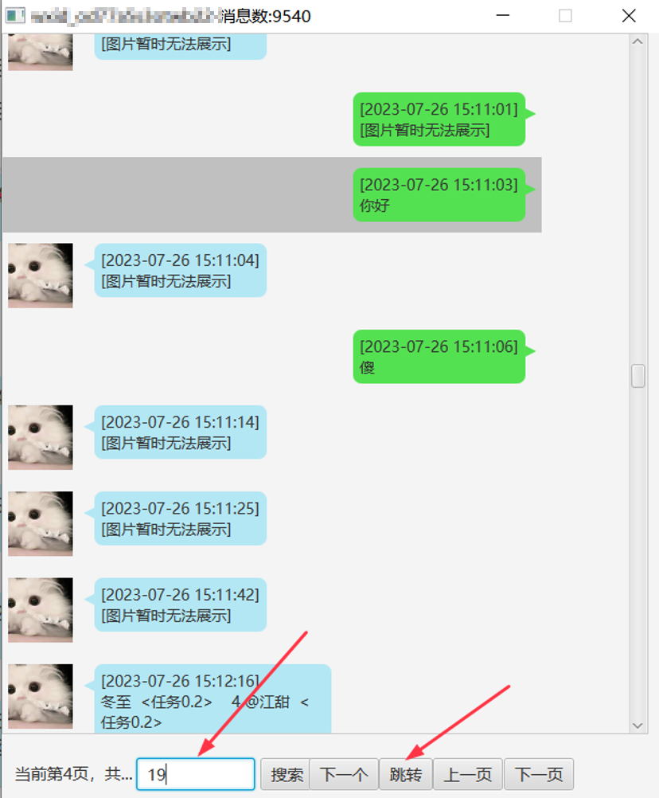
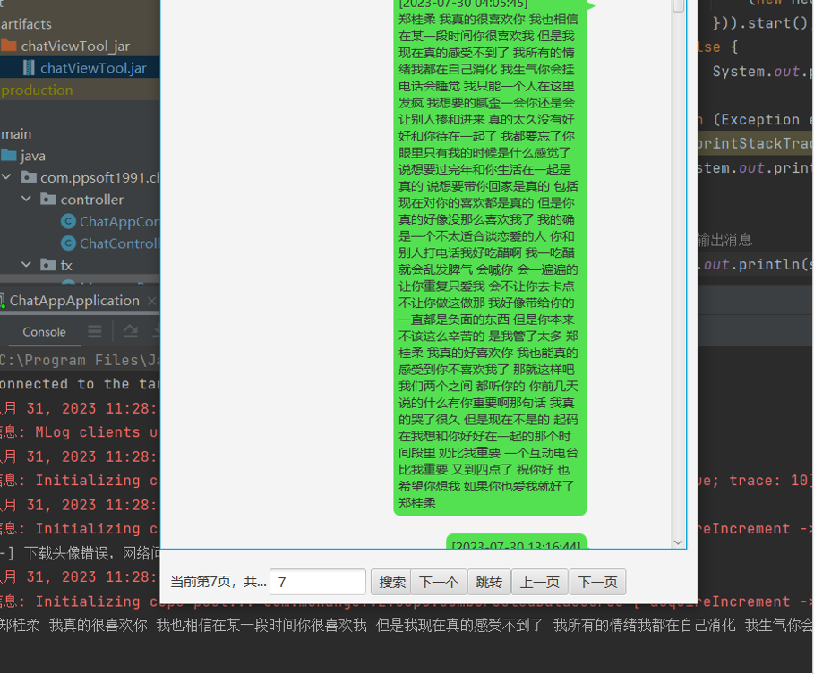

# ChatViewTools

ChatViewTools是一款微信聊天工具搜刮工具，逆向[Ormicron/chatViewTool](https://github.com/Ormicron/chatViewTool)后更改而来

做了大量的更新和性能优化，与原版相比优化了：

- 解密速度
- 打开聊天窗口的速度
- 聊天记录搜索速度
- 展示方式，可展示群头像、群友ID

# 使用说明
首先找到DBPass.Bin文件，用nodepad++打开，如果不是UTF-8编码，需要改为UTF-8

点击数据库解密，选择文件夹

Console端会有输出,解密完成后自动会从微信服务器下载头像

搜索聊天记录

搜索完查看console输出

需要查看聊天上下文的话，复制wxid，填入搜索框，点击进入聊天

就能弹出消息框

然后将刚才的关键字重新输入，

可以看到共找到5条

点击下一个

搜索结果会高亮显示

也可以填入页数，直接跳转到对应页面

复制聊天内容
遇到需要复制的内容，双击，会在console中显示，在console中复制就好了

